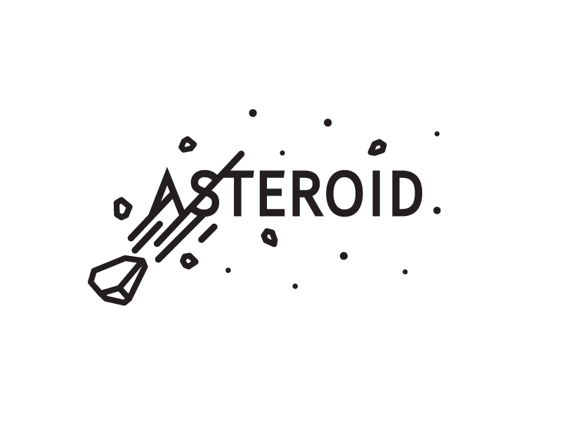

  

<h1 align="center">
  <b>ASTEROID - USERBOT</b>
</h1>

<b>A stable pluggable Telegram userbot based on Telethon.</b>   

----

# Deploy
- [Heroku](#Deploy-to-Heroku)
- [Local Machine](#Deploy-Locally)

# TEAM

# Tutorial 
- Full Tutorial - 

- Tutorial to get Redis URL and password - [here.](./resources/extras/redistut.md)
---

## Deploy to Heroku
Get the [Necessary Variables](#Necessary-Variables) and then click the button below!  

## Deploy Locally
- [Traditional Method](#local-deploy---traditional-method)
- [Easy Method](#local-deploy---easy-method)

### Local Deploy - Easy Method
- Linux - `bash -c "$(curl -fsSL https://git.io/JY9UM)"`
- Windows - `cd desktop ; wget https://del.dog/raw/ultroid-termux -o locals.py ; python locals.py`
- Termux - `sh -c "$(curl -fsSL https://del.dog/raw/ultroid-termux-deploy)"`

### Local Deploy - Traditional Method
- Get your [Necessary Variables](#Necessary-Variables)
- Clone the repository:  
`git clone https://github.com/TeamUltroid/Ultroid.git`
- Go to the cloned folder:  
`cd Ultroid`
- Create a virtual env:    
`virtualenv -p /usr/bin/python3 venv`
`. ./venv/bin/activate`
- Install the requirements:    
`pip(3) install -U -r requirements.txt`
- Generate your `SESSION`:
  - For Linux users:
    `bash sessiongen`
     or
    `bash -c "$(curl -fsSL https://del.dog/ultroid)"`
  - For Termux users:
    `sh -c "$(curl -fsSL https://da.gd/termux-tel)"`
  - For Windows Users:
    `cd desktop ; wget https://del.dog/ultroid -o ultroid.py ; python ultroid.py`
- Fill your details in a `.env` file, as given in [`.env.sample`](https://github.com/TeamUltroid/Ultroid/blob/main/.env.sample).
(You can either edit and rename the file or make a new file named `.env`.)
- Run the bot:
  - Linux Users:
   `bash resources/startup/startup.sh`
  - Windows Users:
    `python(3) -m pyUltroid`

## Necessary Variables
- `API_ID` - Your API_ID from [my.telegram.org](https://my.telegram.org/)
- `API_HASH` - Your API_HASH from [my.telegram.org](https://my.telegram.org/)
- `SESSION` - SessionString for your accounts login session. Get it from [here](#Session-String)
- `REDIS_URI` - Redis endpoint URL, from [redislabs](http://redislabs.com/), tutorial [here.](./resources/extras/redistut.md)
- `REDIS_PASSWORD ` - Redis endpoint Password, from [redislabs](http://redislabs.com/), tutorial [here.](./resources/extras/redistut.md)

## Session String
Different ways to get your `SESSION`:
* 
* Linux : `bash -c "$(curl -fsSL https://del.dog/ultroid)"`
* PowerShell : `cd desktop ; wget https://git.io/JY9JI ; python ultroid.py`
* Termux : `sh -c "$(curl -fsSL https://da.gd/termux-tel)"`

Made with 💕 by [ASTEROID](https://t.me/Asteriod_support).  

# License
ASTEROID is licensed under [GNU Affero General Public License](https://www.gnu.org/licenses/agpl-3.0.en.html) v3 or later.

# Credits
* [Javes 2](https://t.me/JavesGrouP)
* [AVENGER-X](https://t.me/AVENGERXCHAT)
 
# Special Credits
* [SHIVANSH](https://t.me/Royal_Boy_45)
* [AMAAN](https://t.me/CoPYLess786)
* [MD NOOR](https://t.me/SimpleBoy785)
* [PAWAN](https://t.me/OYA_BSDK_BAAP_KO_TAG_MAT_KAR)

